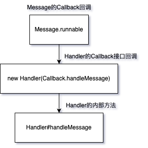

- ### Handler，Message，MessageQueue，Looper之间的关系
  [](https://github.com/Huazhiling/CodeNotes/blob/master/src/Android/img/Handler.jpg)  
  每个线程会有一个Looper，在创建Looper的时候会在创建出一个MessageQueue（MQ），MQ是一个以时间排序的先进先出队列，管理所有的Message。  
  由于Android是事件驱动，所以又叫事件分发机制，Handler也被称为Handler事件分发机制。  
  Handler可以说是Looper，Message，MQ的驱动者，Handler在创建时会根据当前线程绑定Looper，
  以Looper为链接将Message和MQ也都与自身关联在了一起。
- ### Handler事件分发
  首先，Looper会通过loop()方法开始真正的工作，通过一个"无限"的for循环不停的从MQ中读取，并处理消息。  
  Handler通过sendMessageXXX方法发送一条事件消息，无论调用哪个sendXXX方法，最终都会回到sendMessageAtTime，然后通过MQ的enqueue方法将这个消息加入队列。  
  加入队列的过程是判断这条消息的delay事件，如果时间小于当前最新一条消息的时间，那么会直接插入到队首，第一个消费。否则的话会通过队列循环一个一个判断时间，直到找到合适的位置（可能根据设定的时间插入在中间，也可能在队尾），
  此次，Handler消息入队逻辑完成。
  由于Looper会不听的循坏MQ去去消息，所以会通过MQ的next()方法，拿取队头的消息，在经过nativePollOnce方法的时候，如果当前的MQ里没有消息，那么就会一直阻塞在这里，
  直到超过了设定的时间，或者取到了新消息才会返回。  
  当拿到消息之后，返回该消息，并且把这条消息移除队列，然后通过Handler的dispatchMessage方法，将事件通过回调的方法返回。  
  当Handler把该事件消耗后，此次事件的分发到此结束

- ### Handler回调优先级
  回调优先级顺序如下  
  [](https://github.com/Huazhiling/CodeNotes/blob/master/src/Android/img/Handler回调顺序.jpg)

# 进阶一下

- ### 一个线程有几个Looper
  一个线程只会有一个Looper，具体通过ThreadLocal类实现，保存的是线程变量，如果当前保存的线程已经存在，则会抛出异常
  ```java
    private static void prepare(boolean quitAllowed) {
        if (sThreadLocal.get() != null) {
            throw new RuntimeException("Only one Looper may be created per thread");
        }
        sThreadLocal.set(new Looper(quitAllowed));
    }
  
    public T get() {
        Thread t = Thread.currentThread();
        ThreadLocalMap map = getMap(t);
        if (map != null) {
            ThreadLocalMap.Entry e = map.getEntry(this);
            if (e != null) {
                @SuppressWarnings("unchecked")
                T result = (T)e.value;
                return result;
            }
        }
        return setInitialValue();
    }
  ```
  在prepare方法里，我们可以看到，如果从TL里面获取到数据不为空，证明当前线程已经有Looper了，就会抛出异常提示。
  TreadLocal的实现会在后续更新

- ### 为什么Looper的for循环不会导致线程卡死
  一段代码肯定是按照顺序去直接，当执行到最后一行代码的时候，这个程序也就退出了，所以想要一直保持，就必须要让代码无法结束。  
  这里用的就是一段"无限制条件"的for循环，因为Android是基于Linux内核的，所以用的是epoll管道机制进行一个事件的通知消费。  
  for循环本身不会导致程序的卡死，宕机。真正造成卡死的原因，是因为在某些方法里做了耗时操作，又或者说做了超过规定时间的事情，比如说`Thread.sleep()`。   
  举个例子说，代码上通过`invalidate()`方法想要通知UI更新，或者点击屏幕出发了`dispathTouchEvent()`方法进行事件传递，但在做这个这个事情的时候，你又触发了耗时操作，
  就会导致这个方法无法传递，必须要等到耗时操作结束之后才能继续运转，在体验上就会有明显的卡顿，如果耗时过长，那自然就会导致卡死崩溃，系统就会直接提示无响应。
  那既然说了for循环本身不会导致程序卡死，又需要通过for循环不停的去MQ取消息进行分发，那他是怎么做到的呢？接下来我们看代码，通过Java层->Native层，看一看这一块逻辑是怎么处理的