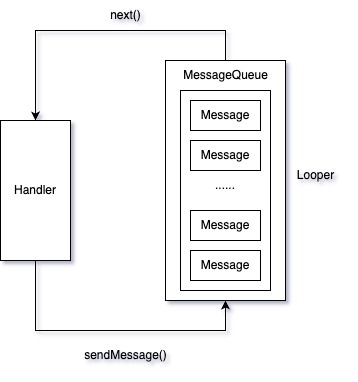

- ### Handler，Message，MessageQueue，Looper之间的关系
    
  每个线程会有一个Looper，在创建Looper的时候会在创建出一个MessageQueue（MQ），MQ是一个以时间排序的先进先出队列，管理所有的Message。  
  由于Android是事件驱动，所以又叫事件分发机制，Handler也被称为Handler事件分发机制。  
  Handler可以说是Looper，Message，MQ的驱动者，Handler在创建时会根据当前线程绑定Looper，
  以Looper为链接将Message和MQ也都与自身关联在了一起。
- ### Handler事件分发
  首先，Looper会通过loop()方法开始真正的工作，通过一个"无限"的for循环不停的从MQ中读取，并处理消息。  
  Handler通过sendMessageXXX方法发送一条事件消息，无论调用哪个sendXXX方法，最终都会回到sendMessageAtTime，然后通过MQ的enqueue方法将这个消息加入队列。  
  加入队列的过程是判断这条消息的delay事件，如果时间小于当前最新一条消息的时间，那么会直接插入到队首，第一个消费。否则的话会通过队列循环一个一个判断时间，直到找到合适的位置（可能根据设定的时间插入在中间，也可能在队尾），
  此次，Handler消息入队逻辑完成。
  由于Looper会不听的循坏MQ去去消息，所以会通过MQ的next()方法，拿取队头的消息，在经过nativePollOnce方法的时候，如果当前的MQ里没有消息，那么就会一直阻塞在这里，
  直到超过了设定的时间，或者取到了新消息才会返回。  
  当拿到消息之后，返回该消息，并且把这条消息移除队列，然后通过Handler的dispatchMessage方法，将事件通过回调的方法返回。  
  当Handler把该事件消耗后，此次事件的分发到此结束

- ### Handler回调优先级

# 进阶一下

- ### 一个线程有几个Looper

- ### 为什么Looper的for循环不会导致线程卡死

- ### native层实现